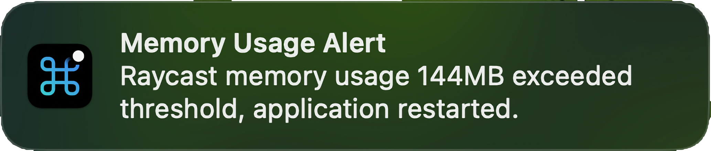
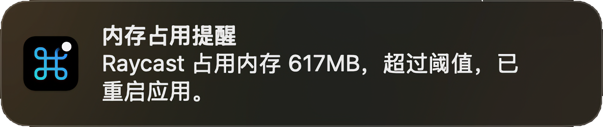

# Raycast Memory Monitor

A lightweight macOS shell script that automatically monitors and manages Raycast’s memory usage.
If Raycast consumes more than a defined memory threshold (default: 420 MB), the script will automatically restart the app and notify the user.

## Features

- Monitors Raycast’s memory usage periodically
- Automatically restarts Raycast when memory exceeds threshold
- Sends macOS system notifications on restart (optional if IBM Notifier is installed)
- Writes detailed logs for each check
- Supports both direct LaunchAgent install and Homebrew service workflow


## Configuration

| Setting | Description | Default |
|----------|--------------|----------|
| `APP_NAME` | Application name to monitor | `Raycast` |
| `MEM_THRESHOLD_MB` | Memory threshold (in MB) before restart | `420` |
| `LOG_FILE` | Path to the log file | `~/raycast_mem_monitor.log` |
| `START_INTERVAL` | Memory check frequency in seconds | `300` |

Configuration is stored in:

```bash
~/Library/Application Support/raycast_mem_monitor/raycast_mem_monitor.conf
```

## Homebrew Installation

```bash
brew tap --custom-remote ManicEuphoria/raycast-mem-monitor https://github.com/ManicEuphoria/raycast_mem_monitor
brew install --HEAD maniceuphoria/raycast-mem-monitor/raycast-mem-monitor
brew services start raycast-mem-monitor
```

This flow installs the `rmm` command into Homebrew’s `bin` and starts the background service with `brew services`.

Useful commands:

```bash
rmm status
rmm install-notifier
rmm check
rmm -cm 500
rmm -ct 200
brew services restart raycast-mem-monitor
```

When you run `rmm -cm 500` or `rmm -ct 200`, the config file is updated and any running `rmm` service is restarted immediately so the new values take effect at once.

## Direct Installation

```bash
./deploy.sh
```

This installs a user LaunchAgent directly and also places the `rmm` command on your PATH when possible.

Useful commands:

```bash
./deploy.sh
./deploy.sh status
./deploy.sh uninstall
rmm -i
rmm install-notifier
rmm -cm 500
rmm -ct 200
```

`rmm -i` and `./deploy.sh` are equivalent for the direct-install path.

## Command Reference

```bash
rmm -i
rmm -n
rmm install-notifier
rmm -cm 500
rmm -ct 200
rmm check
rmm status
rmm uninstall
```

## Testing

```bash
bash tests/test_rmm.sh
```

## Logs

All activity is logged to:
```bash
~/raycast_mem_monitor.log
```
Each entry includes a timestamp, current memory usage, and restart actions.

## Notifications

If you want to use system notification, please install [IBM Notifier](https://github.com/IBM/mac-ibm-notifications).

You can install it directly with:

```bash
rmm install-notifier
```

Or the short form:

```bash
rmm -n
```

The installer writes to `/Applications` when it is writable, otherwise it falls back to `~/Applications`.

**English Notification:** <br>


**Chinese Notification:** <br>


## Notes

- Homebrew mode uses `brew services start raycast-mem-monitor`.
- Direct mode uses a LaunchAgent rendered from `com.user.raycastmem.plist`.
- To stop the direct-install service:
```bash
./deploy.sh uninstall
```

## License

MIT License — free to use and modify.
Developed with ❤️ for a smoother Raycast experience.
